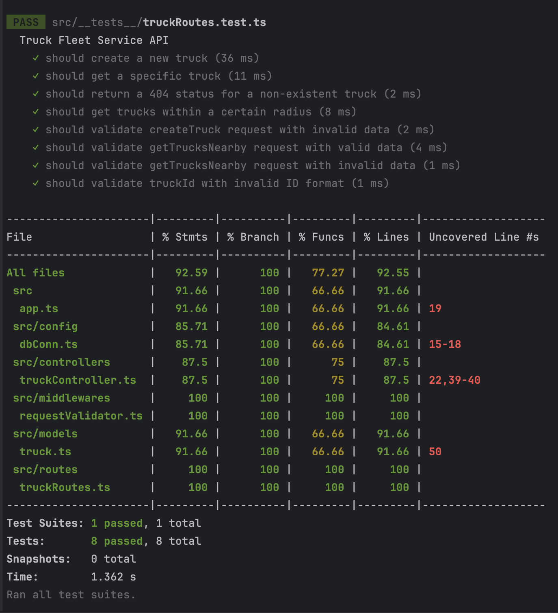

# cand-Ugo-Ejikeme
Take Home Task (Backend) for Tech Talk

## Dependencies
- MongoDB
- Node.js
- Yarn

## Installation (Without Docker)
- Clone the repository
- Run `yarn install` to install dependencies
- Run `yarn start` to start the server

## Usage
- Run `yarn test` to run tests

## Seed Data
- Run `yarn seed` to seed the database with sample data

## With Docker
- Run `docker-compose up` to start the server
- Run `docker-compose down` to stop the server
- Run `docker-compose run --rm app yarn test` to run tests
- Run `docker-compose run --rm app yarn seed` to seed the database with sample data

## API Endpoints

### Create a New Truck

- **Method:** POST

- **URL:** /

- **Request Body:** JSON object with truck details

- **Example:**

  ```json
  {
    "make": "Ford",
    "year": 2022,
    "capacity": 6000,
    "status": "Available",
    "latitude": 40.7128,
    "longitude": -74.0060
  }
    ```
  
- **Response:** JSON object with truck details
- **Example:**

  ```json
  {
    "_id": "65403f538ec0bbe919eaf64c",
    "make": "Ford",
    "year": 2022,
    "capacity": 6000,
    "status": "Available",
    "latitude": 40.7128,
    "longitude": -74.0060
  }
  ```
  
### Get All Trucks

- **Method:** GET
- **URL:** /
- **Response:** JSON array of truck objects
- **Example:**

  ```json
  [
    {
      "_id": "65403f538ec0bbe919eaf64c",
      "make": "Ford",
      "year": 2022,
      "capacity": 6000,
      "status": "Available",
      "latitude": 40.7128,
      "longitude": -74.0060
    },
    {
      "_id": "65403f538ec0bbe919eaf64d",
      "make": "Toyota",
      "year": 2021,
      "capacity": 5000,
      "status": "Unavailable",
      "latitude": 40.7128,
      "longitude": -74.0060
    }
  ]
  ```
  
### Get a Truck

- **Method:** GET
- **URL:** /:id
- **Response:** JSON object with truck details
- **Example:**

  ```json
  {
    "_id": "65403f538ec0bbe919eaf64c",
    "make": "Ford",
    "year": 2022,
    "capacity": 6000,
    "status": "Available",
    "latitude": 40.7128,
    "longitude": -74.0060
  }
  ```
  
### Get nearby Trucks

- **Method:** GET
- **URL:** /nearby?lat=40.7128&lon=-74.0060&rad=1000
- **Response:** JSON array of truck objects
- **Example:**

  ```json
  [
    {
      "_id": "65403f538ec0bbe919eaf64c",
      "make": "Ford",
      "year": 2022,
      "capacity": 6000,
      "status": "Available",
      "latitude": 40.7128,
      "longitude": -74.0060
    },
    {
      "_id": "65403f538ec0bbe919eaf64d",
      "make": "Toyota",
      "year": 2021,
      "capacity": 5000,
      "status": "Unavailable",
      "latitude": 40.7128,
      "longitude": -74.0060
    }
  ]
  ```

### Test Coverage

